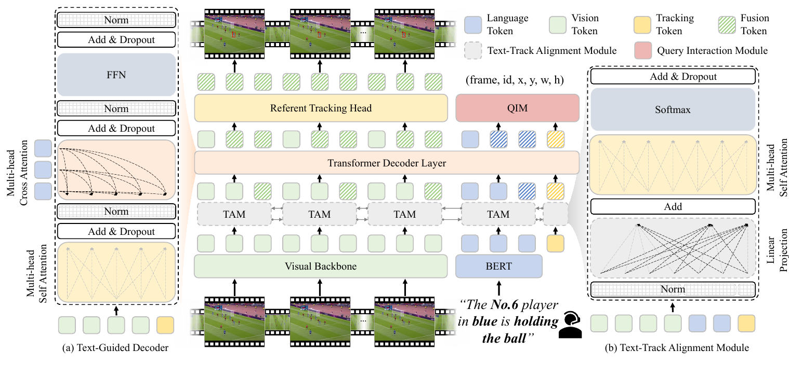
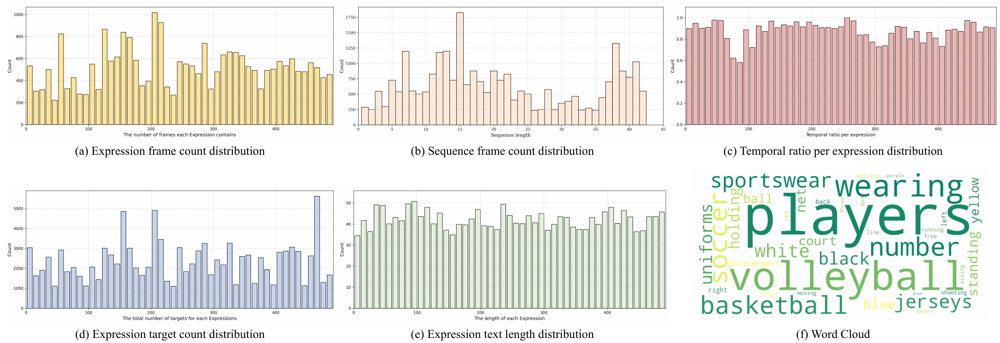

## What, Where, Which: Fine-Grained Referring Multi-Object Tracking in Dynamic Sports Arenas
The official implementation of the paper：
>  [**What, Where, Which: Fine-Grained Referring Multi-Object Tracking in Dynamic Sports Arenas**](##TODO:LINK##)  
>  
>  [**\[Paper\]**](##TODO:LINK##) [**\[Code\]**](##TODO:LINK##)

-----

## Updates
+ [2025.7.05] We have initialized the repo. The related resources will be released after the manuscript is accepted.
-----

## Refer-Sports

   

## Abstract
  Referring multi-object tracking (RMOT) aims to track multiple specific targets based on natural language expressions. Existing RMOT methods primarily rely on simple descriptions generated by static rules (e.g., "a red car"), which limits their capability to capture fine-grained semantic features, such as athlete numbers or behavioral actions. Additionally, current benchmark datasets predominantly focus on static scenes with limited semantic dimensions (color, orientation), lacking annotations that capture motion attributes and temporal dynamics. To address this limitation, we propose an end-to-end Fine-Grained Referring Multi-Object Tracking model (FGRefMOT), which integrates fine-grained textual embeddings of "what", "where", and "which" to enhance tracking performance. Specifically, we develop a Text-Track Alignment Module designed to align textual features with detection and tracking features, thereby mitigating domain discrepancies between pre-trained unimodal representations during cross-modal fusion. Additionally, we propose an Text-Guided Transformer Decoder that iteratively injects fine-grained language cues at the decoding stage to guide the model towards accurately tracking designated targets. Finally, we construct the first fine-grained referring multi-object tracking dataset in dynamic sports environments, Refer-Sports. This dataset covers three scenarios (football, basketball, and volleyball) and consists of 41 videos annotated with 492 unique expressions that include various types of attributes such as appearance and behavioral logic.

## Contributions
+ We propose FGRefMOT, a novel end-to-end framework that mitigates modality bias in fine-grained RMOT through dedicated cross-modal alignment and iterative semantic injection mechanisms.
+ We construct Refer-Sports, the first dataset specifically designed for fine-grained referring multi-object tracking in dynamic sports scenarios, addressing a notable limitation in current benchmarks by providing detailed language-vision annotations.
+ Extensive evaluationson standard benchmarks demonstratee that our method achieves state-of-the-art performance across multiple metrics, providing a new paradigm for referring multi-object tracking.

### Installation
The basic environment setup is on top of [RMOT](https://github.com/wudongming97/RMOT) and [Vim](https://github.com/hustvl/Vim), including conda environment, pytorch version and other requirements.

### Refer-Sports dataset
You can download [our created expression and labels_with_ids](https://pan.baidu.com/s/1LWaynFOUf8vLFAMj_z9Fhg?pwd=trwf). The SportsMOT images are from [official website](https://github.com/MCG-NJU/SportsMOT). The datasets are structured as below:

~~~
├── Refer-Sports
│   ├── SportsMOT
│           └── training
│           └── labels_with_ids
│   ├── expression
├── refer-kitti
│   ├── KITTI
│           └── training
│           └── labels_with_ids
│   ├── expression
~~~
You can download refer-kitti dataset from [here](https://github.com/wudongming97/RMOT)

## Acknowledgement
A large part of the code is borrowed from [RMOT](https://github.com/wudongming97/RMOT), [SportsMOT](https://github.com/MCG-NJU/SportsMOT), [MOTR](https://github.com/megvii-research/MOTR). Thanks for their wonderful works!

## Citation
The related resources will be released after the manuscript is accepted. 

